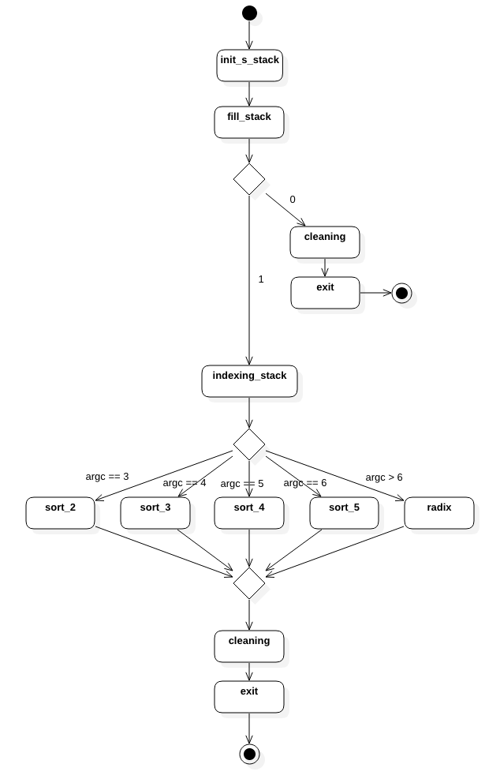

<h1 align="center">Push_swap</h1>

Cinquième projet de [42](https://42.fr/), le but ici est de trier des nombres avec un minimum d'oppérations.

---

### Compilation :

Pour compiler le projet, exécutez la commande suivante :

```
make
```

Pour compiler les tests unitaires, exécutez la commande suivante :

```
make test
```

### Utilisation :

Le programme doit s'exécuter de la façon suivante : 

```
./push_swap [nb1] [nb2] [nb3] ...
```

Les tests unitaires s'executent de la façon suivante :

```
./utest
```

### Exemple d'utiliation :

```
./push_swap 9 3 1 4 -1 -498
```

---
### Diagrammes :

| Diagramme d'activité |
| --- |
|  |

---
### Tests automatisés :

| [null](https://github.com/null) | 
| --- |
|  |
|  |

---
### Correction :

| |
| --- |
|  |

| | |
| --- | --- |
| Correcteur 1 |  |
| Correcteur 2 |  |
| Correcteur 3 |  |
